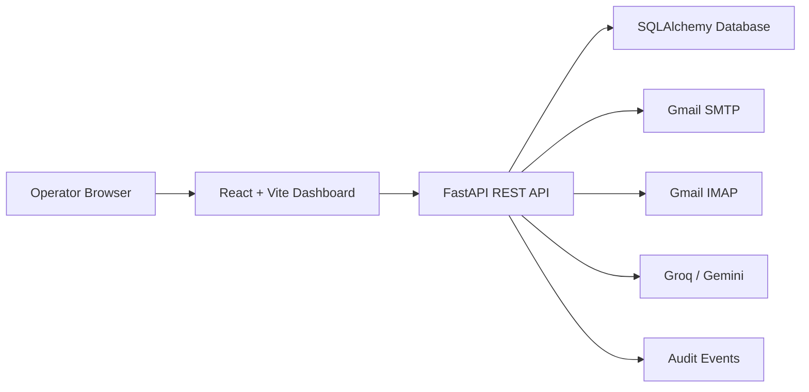
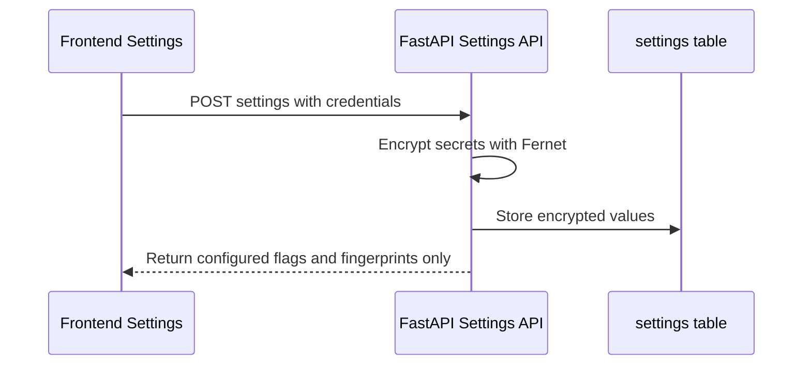
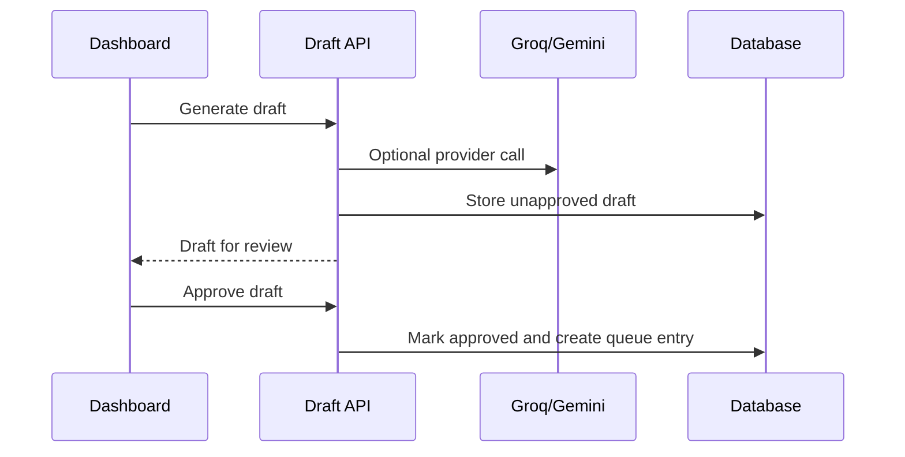
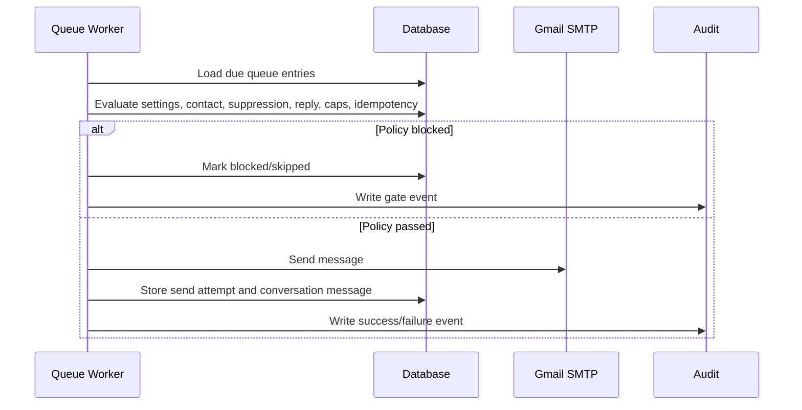
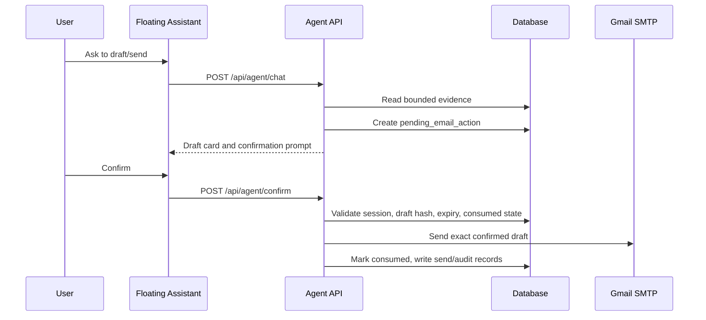

# Architecture

Finimatic is a single-operator email operations app with a FastAPI backend, a React/Vite frontend, and SQLAlchemy-managed storage.

## High-Level Shape



The frontend does not talk directly to Gmail, Groq, Gemini, or the database. All privileged work goes through the backend.

## Backend Responsibilities

The backend owns:

- app startup and router mounting
- CORS configuration
- database session setup
- settings encryption and decryption
- contact lifecycle state
- import validation
- draft storage and approval
- AI provider calls
- send policy evaluation
- Gmail SMTP and IMAP calls
- follow-up scheduling
- assistant routing, tools, pending confirmations, and send execution
- audit redaction and persistence

Main entrypoint:

```text
backend/app/main.py
```

## Frontend Responsibilities

The frontend owns:

- dashboard navigation
- forms and tables
- local UI state
- API calls through `frontend/src/api/client.ts`
- floating assistant widget rendering
- local assistant message history

The frontend must not own:

- Gmail passwords
- Groq keys
- Gemini keys
- SMTP/IMAP execution
- send policy decisions
- final send authority

## Data Flow

### Settings



### Draft And Queue



### Send



### Assistant Send



## Database Tables

Core tables are documented in [../SCHEMA.md](../SCHEMA.md). The main groups are:

- settings
- contacts and imports
- drafts and templates
- send queue and send attempts
- follow-up sequences
- replies and conversation messages
- suppressions
- audit events
- provider health
- agent sessions and pending email actions

## Background Work

The backend starts periodic workers unless `FINIMATIC_DISABLE_SCHEDULER=1`:

- queue worker every 30 seconds
- follow-up worker every 300 seconds
- IMAP reply fetch through APScheduler

For tests and one-off commands, disable the scheduler.

## Security Boundaries

- Secret values are encrypted before storage.
- Settings responses return counts and fingerprints, not raw keys.
- Audit payloads are redacted.
- Assistant tools return bounded evidence envelopes.
- The pending confirmation harness protects assistant sends from replay, expiry, session mismatch, and draft mutation.
