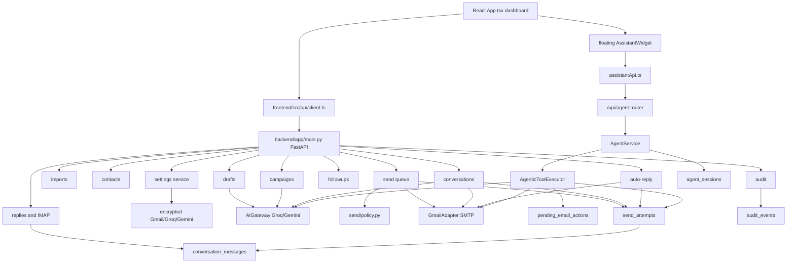

# Finimatic Feature Relations And Conflict Ledger

Generated: 2026-05-26 15:39:52 +05:30

Purpose: expose feature relationships and conflict candidates so a local LLM can find hidden issues and propose safer designs. This file labels conflicts directly. It does not silently reconcile stale docs with current source.

Labels:

- `CONFIRMED`: directly verified in current source/runtime.
- `CONFLICTED`: two evidence sources disagree.
- `RISK`: source-supported risk requiring product/implementation decision.
- `UNVERIFIED`: plausible but not proven by current checks.

## Top-Level Relation Graph



## Core Feature Relations

| Feature | Writes | Reads | Downstream Effects | High-Risk Dependencies |
|---|---|---|---|---|
| Settings | `settings`, `audit_events` | frontend form payload | Enables SMTP, AI, caps, windows, auto-reply config | Fernet key, redaction, no frontend env secrets |
| Import | `import_batches`, `import_rows`, `contacts`, `audit_events` | uploaded rows, suppressions, existing contacts | Contact records for drafts/campaigns | Process-local preview state |
| Contacts | `contacts`, queue/follow-up cancellation, audit | contacts, recently deleted | Soft delete/restore changes send eligibility | All send paths must check `deleted_at` |
| Drafts | `drafts`, `send_queue`, `audit_events` | contacts, settings, templates, AI | Approval queues outbound cold email | AI sanitizer, draft approval, deleted-contact checks |
| Templates | `templates` | approved drafts | Reusable copy | Template source must be approved |
| Campaigns | `campaign_plans` | contacts, settings, AI | Campaign planning and activation | Newer than old docs; agent awareness reads campaign state |
| Queue | `send_queue`, `send_attempts`, `conversation_messages`, `follow_up_sequences`, audit | drafts, contacts, settings, suppressions, policy | Cold outbound send path | Canonical policy gate set |
| Follow-ups | `follow_up_sequences`, `drafts`, `send_queue`, audit | replies, contacts, suppressions, settings | Follow-up proposal and approval | Stops on replies/suppression |
| Replies | `replies`, `contacts`, `suppressions`, `conversation_messages`, follow-up stop, provider health, audit | IMAP/manual input, settings, Groq | Inbound reply handling | IMAP blocking, intent classification, dedupe |
| Conversations | `conversation_messages`, `send_attempts`, contacts, audit | contacts, drafts, replies, attempts, settings, AI | Engaged reply generation/direct send | GET backfill commits, direct-send gate divergence |
| Auto-reply | `drafts`, `send_attempts`, `conversation_messages`, contacts, audit | replies, contacts, settings, quality gate, Gmail | Proposed or autonomous engaged reply | Autonomous send outside queue |
| Agent | `agent_sessions`, `pending_email_actions`, drafts, send attempts, conversation messages, audit | contacts, replies, conversations, queue, followups, settings | Assistant reads, drafts, confirms sends | Confirmation harness, capability routing, evidence bounds |
| Frontend assistant | `localStorage`, `sessionStorage` | `/api/agent/*` | User-facing assistant panel | Pending metadata persistence, attachment metadata-only UX |

## Send Path Relation Matrix

| Send Path | File | Primary Trigger | Policy Function | Writes SendAttempt | Writes ConversationMessage | Uses GmailAdapter | Idempotency Basis | Notable Difference |
|---|---|---|---|---|---|---|---|---|
| Queue cold send | `backend/app/send/queue_worker.py` | Queue process/background loop | `send/policy.py:evaluate_policy` | yes | yes | yes | queue entry idempotency key | Most complete canonical gate set. |
| Canary send | `backend/app/send/canary_router.py` | `/api/canary/send` | canary duplicate/readiness logic | yes | no | yes | nonce/timestamp canary key | Verifies sender before lead sends. |
| Conversation send | `backend/app/conversations/router.py` | `/api/conversations/{contact_id}/send` | local `_engaged_send_block_reasons` | yes | yes | yes | `sha256_key("conversation", contact.id, sent_at, subject, body)` | Engaged direct send, not queue policy. |
| Auto-reply autonomous send | `backend/app/conversations/auto_reply_service.py` | reply handling in autonomous mode | `_can_auto_reply` plus internal send checks | yes | yes | yes | `sha256_key("auto_reply", contact.id, reply_id or draft.id)` | AI-driven autonomous direct send outside queue. |
| Agent confirmed send | `backend/app/agent/tools.py` | `/api/agent/confirm` after pending action | local `_engaged_send_block_reasons` plus pending harness | yes | yes | yes | `sha256_key("agent", action_id, draft.id)` | Consumes pending action before SMTP provider result. |

Architecture question: should there be one shared `engaged_send_policy.py` for conversation, auto-reply, and agent direct sends, with explicit documented differences from cold queue sends?

## Agent Pipeline Relation

```text
AssistantWidget
  -> assistantApi.chat()
  -> POST /api/agent/chat
  -> AgentService.chat()
  -> get_or_create_session(hash(session_token))
  -> build context card/contact name map
  -> classify_channel()
     -> awareness: answer_awareness_query()
     -> task/action: GoalFrameAgent -> IntentAgent -> check_capability_tiered()
  -> SlotAgent
  -> OrchestratorAgent
  -> AgenticToolExecutor
  -> ReasoningAgent
  -> VerifierAgent
  -> optional create_pending_action()
  -> ResponseAgent
  -> update agent_session
  -> emit audit_event
```

Confirmation relation:

```text
email_generate_draft
  -> Draft row created, approved=false
  -> create_pending_action(session, draft, contact, subject, body)
  -> frontend pending draft card
  -> Confirm button
  -> POST /api/agent/confirm { session_token, action_id }
  -> validate_pending_action()
  -> AgenticToolExecutor.email_send_draft
  -> revalidate pending action
  -> engaged-send gates
  -> consume_pending_action()
  -> GmailAdapter.send_message() in executor
  -> SendAttempt + ConversationMessage + audit
```

## Conflict Ledger

### 1. Alembic Does Not Rebuild Live Schema

Label: `CONFIRMED`

Evidence:

- `backend/app/db/migrations/versions/0001_initial.py` has `pass` in upgrade/downgrade.
- `backend/app/db/session.py` calls `Base.metadata.create_all()` and adds lightweight columns with `ALTER TABLE`.
- `backend/app/db/models.py` live `AgentSession` includes `context_loaded_at`, `contact_name_map`, `turn_history`, `current_channel`.
- `0002_agent_tables.py` creates `agent_sessions` without those extra columns.
- Active `backend/finimatic.db` includes the extra columns because runtime startup migrations added them.

Impact:

- A production database created by Alembic alone can miss live columns and fail at runtime.
- Docs and migrations are not enough for a local LLM to infer current schema.

Safer direction:

- Generate an Alembic migration that encodes current `models.py` parity.
- Stop using startup lightweight migrations as the primary schema evolution mechanism, or document them as local-only repair.

### 2. `SCHEMA.md` Is Stale Against Live Models

Label: `CONFIRMED`

Evidence:

- `SCHEMA.md` omits `conversation_messages`, `templates`, `campaign_plans`, `agent_sessions`, `pending_email_actions`.
- Live `models.py` includes all of those.
- Live `Contact`, `Draft`, and `Reply` contain columns absent from `SCHEMA.md`.

Impact:

- Any local LLM using `SCHEMA.md` alone will miss current behavior.

Safer direction:

- Regenerate schema documentation from `models.py` and active migration truth.

### 3. Project Report Route/Table Map Is Stale

Label: `CONFIRMED`

Evidence:

- `PROJECT_IMPLEMENTATION_REPORT.md` route map ends before `/api/agent`, `/api/campaigns`, `/api/auto-reply`.
- `backend/app/main.py` mounts `auto_reply_router`, `campaigns_router`, and `agent_router`.
- `models.py` includes campaign and agent tables.

Impact:

- Older reports understate the app's current behavioral surface and side-effect paths.

Safer direction:

- Mark historical reports as snapshots and generate route/table docs from source.

### 4. Agent Runtime Pipeline Differs From Spec

Label: `CONFLICTED`

Evidence:

Spec side:

- `AGENTS.md` and `AGENT_SCHEMA_EXTENSION.md` describe Groq-backed GoalFrame, Intent, Slot, Reasoning, Verifier, and Response agents.

Source side:

- `goal_frame.py`, `intent.py`, `slot.py`, `orchestrator.py`, `reasoning.py`, `verifier.py`, and `response.py` are deterministic/rule-based.
- `channel_router.py` may call Groq for channel classification if keys exist.

Impact:

- Runtime may be safer/deterministic but does not match the specified "Groq per stage" architecture.
- LLM review should not assume every stage is model-generated.

Safer direction:

- Decide whether deterministic implementation is intentional.
- Update docs or implement provider-backed stages consistently.

### 5. Exact Capability Catalog Coexists With Broader Tier Routing

Label: `CONFLICTED`

Evidence:

Spec side:

- `AGENTS.md` says deny everything not listed.

Source side:

- `CAPABILITY_CATALOG` contains the exact nine action capabilities.
- `CAPABILITY_TIERS` also lists `campaign_intelligence`, `group_resolve`, `template_generate`, `auto_reply_approve`, `campaign_activate`, and more.
- `check_capability_tiered()` can redirect unknown awareness/task requests to `campaign_intelligence`.
- Tests assert this behavior in `test_capability_tiers.py`.

Impact:

- The strict executor still denies unknown tool calls, but user-facing awareness may answer instead of denying.
- This is probably a product extension, but it conflicts with a strict reading of the original instruction.

Safer direction:

- Document two separate concepts:
  - executable tool capabilities
  - awareness/intent routing categories
- Keep side-effect tools deny-by-default.

### 6. Agent Tool Evidence Contract Is Wider Than Spec For Contact Resolve

Label: `CONFIRMED`

Evidence:

Spec side:

- `contact_resolve` returns `{id, email, creator_name, business_name, status, tags}` with max 5 matches.

Source side:

- `backend/app/agent/tools.py` also returns `lead_category`, `suppressed`, `suppression_reason`, and `personalization`.
- Sanitization redacts secrets but does not globally cap all contact string fields.

Impact:

- Private segmentation/personalization context can enter agent evidence.
- This matters more if deterministic reasoning is later replaced by provider calls.

Safer direction:

- Bound and explicitly whitelist all contact evidence fields.
- Consider excluding `personalization` unless a capability requires it.

### 7. Agent Direct Send Policy Duplicates Queue Policy

Label: `RISK`

Evidence:

- Canonical queue policy lives in `backend/app/send/policy.py`.
- Agent direct send has `_engaged_send_block_reasons()` in `backend/app/agent/tools.py`.
- Conversation direct send has another `_engaged_send_block_reasons()` in `backend/app/conversations/router.py`.
- Auto-reply has its own `_can_auto_reply()` and send logic.

Known differences:

- Queue policy checks deleted contact, draft approval, no active reply, idempotency duplicate, and cold-send constraints.
- Agent direct send is an engaged reply path and intentionally may not use cold `no_reply` semantics.
- Agent direct send should still consider deleted contact and common hard blocks.

Impact:

- Policy drift can cause one path to send when another would block.

Safer direction:

- Extract shared hard-send gates:
  - sender configured
  - canary verified
  - dry-run
  - deleted contact
  - suppression/domain
  - unsubscribe/bounce/manual pause
  - caps/window
- Add explicit mode-specific gates for cold vs engaged reply.

### 8. Pending Action Consumed Before SMTP Result

Label: `RISK`

Evidence:

- `backend/app/agent/tools.py` consumes pending action before calling `GmailAdapter().send_message()`.

Impact:

- Good replay prevention.
- Bad retry experience after transient SMTP/network failure because the same confirmation cannot be reused.

Safer direction:

- Decide intentionally:
  - strict one-time confirmation even on provider failure, or
  - consume only after accepted provider response and separately lock action while in flight.
- If retaining current behavior, surface a user-readable retry path.

### 9. GET Conversation Routes Can Mutate Data

Label: `CONFIRMED`

Evidence:

- `backend/app/conversations/router.py:list_conversations` and `get_conversation` call backfill logic and `db.commit()`.
- Frontend global app load fetches conversations as part of `useAppData()`.
- Browser verification observed that page load triggers many GETs including conversations.

Impact:

- Read-only browser inspection can write rows.
- Caches, prefetchers, and monitoring may mutate the DB.

Safer direction:

- Move backfill to an explicit POST/admin/repair route, or make GET backfill idempotent and separately documented.

### 10. IMAP Fetch Executor Contract Conflict

Label: `CONFLICTED`

Evidence:

Spec side:

- `AGENTS.md` says IMAP and SMTP should always run in `asyncio.get_event_loop().run_in_executor`.

Source side:

- SMTP adapter uses executor for blocking transport work.
- IMAP fetch is synchronous in `replies/imap_fetcher.py` and is called from scheduler/request paths.

Impact:

- Possible request/scheduler blocking and long-running IMAP behavior.
- Provider health currently reports IMAP failed with `TimeoutError`.

Safer direction:

- Wrap IMAP fetch in executor for request paths.
- Keep a concurrency lock and expose timeout/cancel behavior.

### 11. Auto-Reply Autonomous Send Conflicts With Older "AI Suggestion Only" Framing

Label: `CONFLICTED`

Evidence:

Old doc side:

- `AI_INTEGRATION.md` frames AI as suggestion-only and the app owning sends.

Current source side:

- `auto_reply_service.py` can autonomously send through Gmail when enabled and gates pass.

Impact:

- This may be an intended new feature, but old docs are no longer safe statements of system behavior.

Safer direction:

- Update docs to say:
  - standard draft AI is suggestion-only;
  - auto-reply autonomous mode is a guarded side-effect feature.

### 12. Floating Assistant Stores Pending Metadata In LocalStorage

Label: `CONFLICTED`

Evidence:

Spec side:

- Widget guide says conversation history in localStorage should be message text only, no file bytes.

Source side:

- `assistantStore.ts` strips pending body but stores pending action id, contact id, draft id, `to`, subject, source label, and expiry.

Impact:

- Not a raw secret leak, but broader than "message text only."
- Stale pending cards can survive reload with missing body preview.

Safer direction:

- Store only message text and fetch pending status from backend, or store a redacted display-only card with no action id.

### 13. Assistant Accepts Attachments But Sends Metadata Only

Label: `CONFIRMED`

Evidence:

- `AssistantWidget.tsx` accepts images, PDFs, text, CSV, JSON.
- `stripAttachment()` removes file bytes.
- Backend `AgentChatRequest.attachments` accepts metadata but no content processing is implemented.

Impact:

- User may believe the assistant can inspect files when it cannot.

Safer direction:

- Either implement backend file ingestion or show a clear "attachment content is not processed yet" state.

### 14. Assistant Z-Index Can Overlay App Modals

Label: `RISK`

Evidence:

- `AssistantWidget.css` uses z-index 80.
- App modal backdrop uses z-index 40.

Impact:

- Assistant launcher/panel may sit above destructive confirmation modals.

Safer direction:

- Hide/minimize assistant when app modal is open, or place modals in a higher layer.

### 15. Voice Interim Transcript Can Duplicate Text

Label: `RISK`

Evidence:

- `AssistantWidget.tsx` appends transcript segments from each speech result event.

Impact:

- Browser interim/final result behavior may duplicate words.

Safer direction:

- Track result indexes and only append final deltas.

### 16. `Save & Verify` Secret State Clearing Needs Recheck

Label: `RISK`

Evidence:

- `App.tsx` settings flow clears password after `saveVerify`.
- Separate save path clears password, Groq, and Gemini textareas.
- Source review suggests Groq/Gemini clearing after save/verify should be verified per current UI state.

Impact:

- Raw keys may remain in React component state after a verify flow even if not persisted in API response.

Safer direction:

- Clear all sensitive input state after any successful settings write/verify path.

### 17. Local `KEYS.md` Is A High-Risk Ignored Secret File

Label: `RISK`

Evidence:

- `KEYS.md` exists and is ignored by `.gitignore`.
- A read-only scan identified raw Groq/Gemini-looking key prefixes without printing values here.

Impact:

- Safe from git if ignore is honored, but risky for local LLM ingestion, screenshots, backups, or accidental copy.

Safer direction:

- Do not feed `KEYS.md` to local LLMs.
- Move secrets to password manager or encrypted local vault.

### 18. Test Pass Counts In Historical Docs Are Stale

Label: `CONFIRMED`

Evidence:

- Historical artifacts mention 27, 55, 104, 113, 117, 121, 124, 125, and 130 passed.
- Current `python -m pytest` collected 182 and passed 182.

Impact:

- Old "acceptance count" references are no longer current proof.

Safer direction:

- Treat current test run output as current evidence.

### 19. Dependency Documentation Drift

Label: `CONFIRMED`

Evidence:

- `STACK.md` mentions `google-generativeai`.
- `backend/requirements.txt` uses `google-genai`.

Impact:

- Setup docs can install the wrong SDK.

Safer direction:

- Update stack docs from actual requirements.

### 20. Runtime Provider Health Shows IMAP Failure

Label: `CONFIRMED`

Evidence:

- Safe `GET /api/provider-health` returned provider `imap` status `failed`, error `TimeoutError`.

Impact:

- Reply/follow-up/auto-reply assumptions relying on mailbox fetch may be wrong in current runtime.

Safer direction:

- Surface IMAP failure prominently in dashboard and agent answers.
- Add a no-side-effect health troubleshooting flow.

## Conflict-Free Invariants Verified

- Backend tests pass in isolated temp DB with fake transport.
- Frontend production build passes.
- Frontend API base uses only `VITE_API_URL`.
- Agent public endpoints exist in OpenAPI.
- Floating assistant launcher and panel render in browser.
- Floating assistant pointer-events contract holds.
- Agent confirmation tests cover valid, consumed, expired, session mismatch, hash mismatch, cancel, no raw key response, and generate-draft-not-send.
- Runtime safe GET responses checked did not expose raw `gsk_`, `AIza`, or plaintext password fields.

## Local LLM Investigation Tasks

Use these as direct questions for the local LLM:

1. Compare all send paths and produce a single required hard-gate matrix.
2. Determine whether agent engaged send should block deleted contacts and duplicate successful sends.
3. Determine whether GET conversation backfill should be moved out of GET routes.
4. Generate a model-vs-Alembic schema diff and propose exact migrations.
5. Decide whether `CAPABILITY_TIERS` should be renamed and documented separately from executable capabilities.
6. Audit every field returned by agent tools for redaction and bounding.
7. Audit frontend localStorage/sessionStorage against the widget guide and secret policy.
8. Review autonomous auto-reply against the product promise and user consent model.
9. Review IMAP fetch blocking/timeout behavior and provider health propagation.
10. Review stale docs and remove or mark obsolete statements that could mislead future implementation.

## Non-Issues Or Intentional Differences To Preserve Unless Product Says Otherwise

- Agent chat rejecting text "send it" without clicking Confirm is intentional.
- Pending action one-time use is intentional; only retry behavior needs product decision.
- Conversation and agent sends may intentionally bypass cold-send `no_reply` semantics because they are engaged replies.
- Tests intentionally contain fake key-like strings to verify redaction; do not treat those test literals as leaked live secrets.
- Frontend attachment file bytes are intentionally not stored; the conflict is UX/processing clarity, not raw file persistence.
